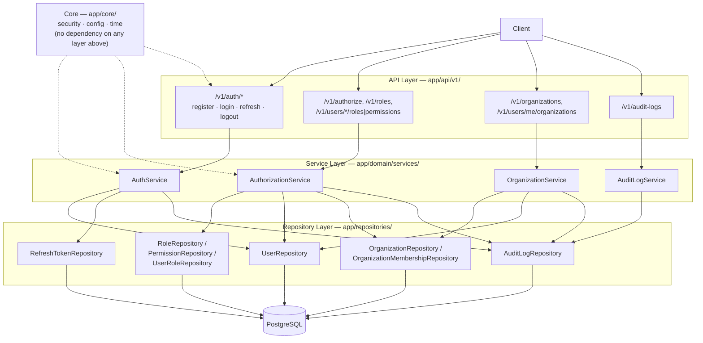

# SecureIAM — Architecture Overview

This is the current, whole-system architecture reference, covering
everything implemented through Phase 5. It complements — rather than
replaces — the deeper, phase-specific documents:

- [`docs/architecture.md`](architecture.md) — Phase 1's original
  layering rationale (still the governing principle for every layer
  added since)
- [`docs/security-review.md`](security-review.md) — authentication and
  refresh-token security decisions and rationale
- [`docs/phases/`](phases/) — one document per phase, the detailed
  design record for every decision below
- [`docs/PROJECT_STATUS.md`](PROJECT_STATUS.md) — the current,
  living source of truth for what's implemented vs. planned

---

## System Overview

SecureIAM answers two questions on behalf of client applications:
**"who is this?"** (authentication) and **"can they do this?"**
(authorization) — plus a third, less commonly built well: **"what
happened, and can I prove it?"** (audit logging). It is layered strictly
as API → Service → Repository → Database, with a dependency-free Core
layer (security primitives, config, time) used by every layer above it
but depending on none of them.



**Why this shape:** each layer answers exactly one kind of question, and
nothing else.
- **API layer** — HTTP concerns only: request validation, calling a
  service, translating a small, fixed set of domain exceptions into
  status codes. `HTTPException` exists *only* here (and in
  `get_current_user`/`require_permission`).
- **Service layer** — business rules and workflows. Zero SQL, zero
  SQLAlchemy, zero FastAPI — verified for `AuthService` by an `ast`-based
  test that inspects actual imports, not just a docstring claim.
- **Repository layer** — persistence only. A repository answers "what
  does the database say," never "should this be allowed." Several
  repositories are deliberately missing methods on purpose (e.g. no
  `PermissionRepository.create_permission`, no `AuditLogRepository`
  update/delete) — the absence is the design.
- **Core layer** — password hashing, JWT issuance/validation, refresh
  token generation/hashing, typed fail-fast configuration. Pure,
  independently testable, aware of nothing above it.

---

## Data Model

| Table | Purpose | Key design point |
|---|---|---|
| `users` | Registered accounts | Argon2id `password_hash`; `is_active` gates authorization, not authentication |
| `refresh_tokens` | Rotation chain for refresh tokens | `token_hash` only (SHA-256) — the raw token is never stored; `replaced_by` forms a strictly linear rotation chain, used for reuse detection |
| `roles` | RBAC roles | Nullable `organization_id` — `NULL` = global/system role, non-`NULL` = org-scoped custom role |
| `permissions` | `(resource, action)` catalog | Global, never forked per tenant |
| `role_permissions` | Role → permission grants | Pure association table |
| `user_roles` | User → role assignments | Nullable `organization_id`; partial unique indexes distinguish a duplicate *global* assignment from a duplicate *org-scoped* one |
| `organizations` | Tenants | Minimal — just an identity other tables reference |
| `organization_memberships` | User ↔ organization | Answers "is this user part of this org," a distinct question from "what role do they hold" |
| `audit_logs` | Append-only security event log | `ON DELETE SET NULL` (not `CASCADE`) on actor/organization — the historical record survives deletion of what it references |

All migrations are Alembic-managed (`app/db/migrations/`); `pgcrypto` is
created by the initial migration itself, not a manual setup step.

---

## Authentication Flow

**Registration** — `POST /v1/auth/register`
```
Client → API → AuthService.register()
             → hash_password() (Argon2id)
             → UserRepository.create_user()
             → audit: user.registered / user.registration_failed
```

**Login** — `POST /v1/auth/login`
```
Client → API → AuthService.login()
             → UserRepository.get_by_email()
             → verify_password() (Argon2id)
             → issue access token (JWT, 15 min) + refresh token (opaque, 14 days)
             → audit: user.login_succeeded / user.login_failed (+ real reason, internal-only)
```
Unknown email and wrong password return the **identical** response —
enumeration prevention by construction, not convention.

**Refresh (rotation)** — `POST /v1/auth/refresh`
```
Client → API → AuthService.refresh()
             → hash the presented token, look it up
             → validity checks (unknown / revoked / expired / inactive owner)
             → RefreshTokenRepository.create_rotation_pair():
                 atomic UPDATE ... WHERE revoked_at IS NULL
                 → new token created only if that succeeded
             → issue new access + refresh token pair
```

**Reuse detection & token-family revocation** (Phase 5) — the security
property that gets the most attention below:
```
Client replays an already-rotated-away refresh token
  → AuthService detects: token.revoked_at is set AND token.replaced_by is set
  → this is reuse, not an ordinary invalid token
  → RefreshTokenRepository.revoke_descendants() walks replaced_by
    forward to the family's current active leaf and revokes it too
  → audit: refresh_token.reuse_detected (always) +
           refresh_token.family_revoked (only if a live leaf was killed)
  → caller still receives the exact same generic 401 as any other
    invalid-token case — the response never reveals that reuse was detected
```

---

## Authorization Model (RBAC)

```
User → Role (global or organization-scoped) → Permission (resource, action)
```

`AuthorizationService.authorize(user_id, resource, action, organization_id=None)`:
1. Resolves the user; inactive or nonexistent → deny (no further lookup).
2. Resolves the user's full permission set for the given scope — global
   grants always apply; organization-scoped grants apply only within that
   organization.
3. Checks whether `(resource, action)` is in that set.

Deny-by-default, and — enforced by a source-inspection test, not just
convention — **never** implemented as `if role.name == "Admin"`. Every
authorization decision is a data lookup against the resolved permission
set, so granting a new role Admin-equivalent access is a data change
(attach permissions to it), never a code change. No caching anywhere in
this path: a revoked role or removed permission takes effect on the very
next check.

`require_permission(resource, action)` (a FastAPI dependency factory) is
the only place an authorization decision becomes an HTTP status code — a
single generic 403 regardless of *why* access was denied.

---

## Audit Logging

Every register/login/refresh outcome (success **and** every distinct
failure reason) and every successful role/permission/organization
mutation is recorded as an append-only `audit_logs` row: who
(`actor_user_id`), what (`action`), on what (`target_type`/`target_id`),
where (`organization_id`), and arbitrary structured detail
(`event_metadata`, JSONB). The row is never returned in an HTTP response —
it's a separate, internal-only surface — so it can record a more precise
reason (e.g. `wrong_password` vs. `unknown_email`) than the public API
ever reveals, without weakening the enumeration defense.

Read access is a single endpoint, `GET /v1/audit-logs`, gated by an
`audit:view` permission (Admin-only in the seeded role catalog), filterable
by `organization_id` / `actor_user_id` / `action` with bounded pagination.

---

## API Surface

| Method | Path | Auth required | Notes |
|---|---|---|---|
| POST | `/v1/auth/register` | none | 409 on duplicate email |
| POST | `/v1/auth/login` | none | 401 (bad credentials) / 403 (inactive) |
| POST | `/v1/auth/refresh` | refresh token | rotates; reuse triggers family revocation |
| POST | `/v1/auth/logout` | refresh token | idempotent, always 204 |
| POST | `/v1/authorize` | access token | checks the caller's own permissions only |
| POST | `/v1/roles` | `role:manage` | |
| POST/DELETE | `/v1/roles/{id}/permissions[/{id}]` | `role:manage` | |
| GET | `/v1/users/me/permissions` | access token | self-service |
| POST/DELETE | `/v1/users/{id}/roles[/{id}]` | `user:manage` | |
| GET | `/v1/users/{id}/permissions` | `user:manage` | |
| POST | `/v1/organizations` | `organization:manage` | |
| POST/DELETE | `/v1/organizations/{id}/members[/{id}]` | `organization:manage` | |
| GET | `/v1/organizations/{id}/members` | `organization:manage` | |
| GET | `/v1/users/me/organizations` | access token | self-service |
| GET | `/v1/audit-logs` | `audit:view` | filterable, paginated |
| GET | `/health` | none | liveness check |

Full request/response schemas are available interactively via Swagger UI
at `/docs` once the app is running.

---

## Testing Approach

Unit tests exercise the service layer against `unittest.mock.AsyncMock`
repositories — zero database, zero HTTP. Integration tests run against a
real, isolated PostgreSQL instance (`docker-compose.test.yml`) and make
real HTTP calls through `httpx.AsyncClient` against the real FastAPI app —
including a dedicated fresh-database migration check, and both a
real-concurrency (`asyncio.gather`) and a fully deterministic (sequential,
no timing dependency) proof of the refresh-rotation race fix. See the
README's Testing section for current counts and how to run them.
